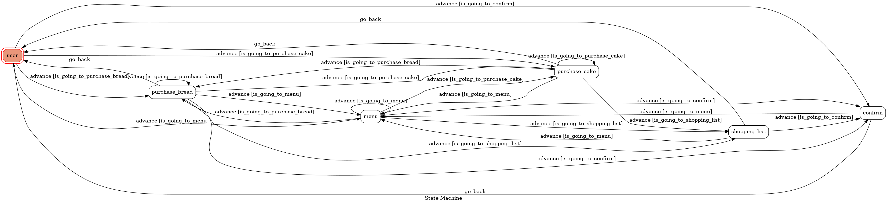
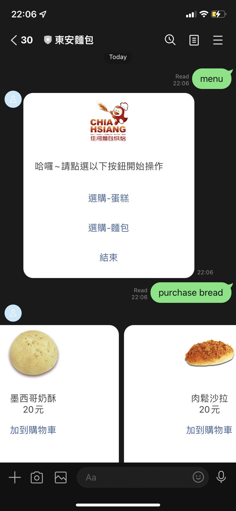

### Environment
* Python 3.6
* Pipenv
* Line
* HTTPS Server

## Finite State Machine

## Usage
1. 輸入 menu 以進入第一個狀態，並得到簡單的操作介面
2. 根據所選按鈕，能夠開始選購 麵包 或是 蛋糕
3. 挑選完畢，隨時都能夠切換另一個購物清單 挑選 (麵包挑完 挑蛋糕等等)
4. 或是能夠按下確定按鈕，以確認訂單，此時商家還不會收到訊息，或是輸入 menu 重新挑選
5. 確認無誤後，手動輸入confirm (避免不小心點到送出按鈕等)
6. 商家得到資訊，可以開始包裝

## 構想
因為家人在做這個，之前有提到過想用 linebot 來增加服務，
使客人能夠在家先將麵包預定，較能掌握當場的數量，及避免客人白跑一趟，卻無麵包的情形

## 操作介面

